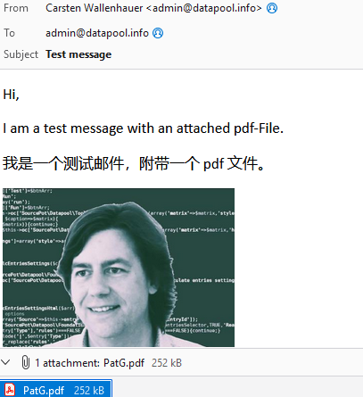
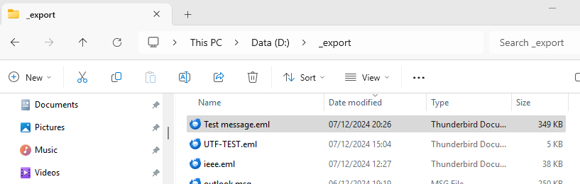
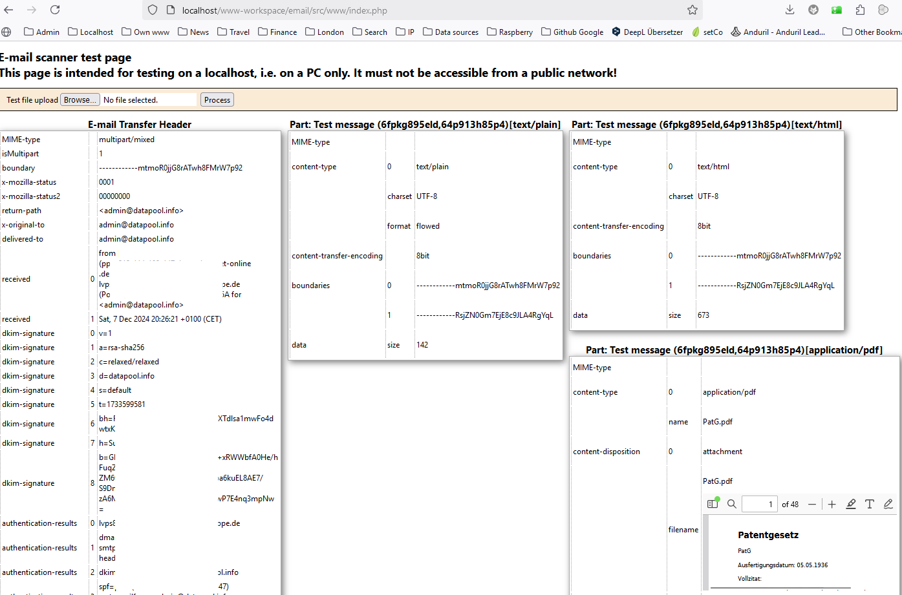

# Email package

So far the email package only contains the scanner class and a test website.

## Scanner class

The scanner class extracts the content and headers of an e-mail that is read in as a string. The result is available as an array. The e-mail formats of the Internet Text Message Standard (e.g. Thimderbird) or OLE (e.g. Outlook) are currently supported.

A test website is part of the pact. An e-mail can be loaded as a file into a temporary directory via the test site and then processed by the scanner class.

Let's start with gthe following test email:


The test email is dragged & dropped form Thunderbird into the Windows file explorer:


The test website is opened on the localhost, the email uploaded and processed, when the "Process" button is clicked. The folloing screenshot shows the test result:


## First  steps using the Scanner class in your project

Create an instance of the Scanner class:
```
$scanner = new \SourcePot\Email\Scanner();
$scanner->load($email);

$emailTransferHeader = $scanner->getHeader();
$emailParts = $scanner->getBody();
```
        
